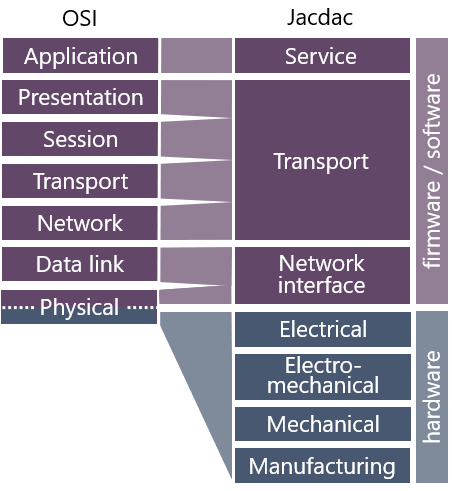
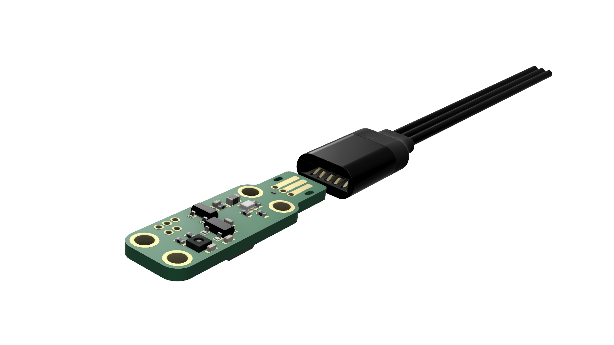

# Reference - overview

Jacdac is an integrated hardware and software stack
that makes it easier to connect programmable microcontrollers,
sensors, actuators, and peripherals together. It also provides a 
bridge from the embedded world to the web browser and beyond. 
Key features of Jacdac are:

-   a dedicated 3-wire cable and connector
-   a true bus topology
-   service advertisement and dynamic device discovery
-   a standardized service abstraction
-   a full stack that supports platforms from 8-bit MCUs to web development.

In addition to the functionality provided by common networking
stacks, the Jacdac protocol specifies electrical and mechanical
requirements that improve interoperability at the hardware level.

A Jacdac [device](/devices) is any device that exposes the [Jacdac PCB edge connector](/ddk/connector/)
and implements the Jacdac protocol. As illustrated above, the protocol consists of three 
core software/firmware layers and several hardware layers.
An overview of these is given below, followed by detailed descriptions of each layer.

## Overview

### Service layer: how devices share hardware and software resources with one another

The way Jacdac devices share resources with other devices on the bus are through [services](/services)
Services provide abstract, standardized interfaces that can be used to interact with
physical hardware resources (e.g. an accelerometer) or pure virtual resources
(e.g. the state of a video game). This abstraction brings plug-and-play dynamism to
Jacdac: devices with the same functionality but different hardware implementations
can be substituted without having to recompile the application that uses them. For example,
two different models of accelerometer hardware can replace each other
because they share the same software interface.

Any device that hosts a service must also run the [control service](/services/control).
The control service is responsible for advertising any services a device
is running every 500 milliseconds. Like any other service,
the packets emitted by the control service are standardized.
There also a set of common commands that must be implemented by Jacdac devices that operate services,
including functionality like `reset` and `time since boot`.

Most Jacdac users will never need to write a service: the major use case is for users
to [program applications](/clients) that interact with Jacdac devices and services.
Using Jacdac in microcontroller applications is incredibly easy and only
requires a software stack that has a compatible Jacdac physical layer.

Services are registered in the [service catalog](/services/)
and are described by [service specifications](/reference/service-specification/).

[Read more about the service layer.](/reference/protocol#service-layer)

### Transport layer: responsible for routing packets between services and applications

The role of the Jacdac transport layer is to
divide frames received by the network interface layer into data packets
and to forward them to the appropriate service or user application.
The transport layer integrates functionality that is split across multiple layers
in other networking stacks, in order to improve efficiency.
It includes naming, addressing, packet description, dynamic service discovery,
and power control (for power providers above 0.5W).

In many cases it is important that data is received by a specific device.
Jacdac supports this mechanism using acknowledgements and pipes.
Acknowledgements are simple and require receiving devices
to recognize that a frame has successfully been received.
Pipes, on the other hand, set up a point-to-point connection between devices,
and every packet is acknowledged and received using a sliding window approach.
Only the most capable devices are expected to support pipes.

The transport layer can optionally support over-the-wire firmware updates.

**A key element of the transport layer is Jacdac device identity. **

By design, the Jacdac protocol does not require central allocation of
guaranteed-unique device identifiers (JDIDs). Instead, device designers and manufacturers are responsible
for allocating a random 64-bit device identifier to each device. From a probabalistic
point of view, this will most likely be unique on any given Jacdac bus and can therefore
be used to identify a sending or receiving device, and allows devices to remember
one another on the bus. Once generated and allocated, a device's identifier must remain constant.
As long identifiers are generated with appropriate
entropy (see analysis below), there is little chance of identifier collision.
We recommend the following ways of generating a unique identifier:

1. Many modern microcontrollers (MCUs) include a factory-programmed unique hardware ID, and this is ideal for creating the Jacdac device identifier - through hashing if needed.

2. Use the random number generator (found below) to allocate an identifier for each device, and flash this number into the MCU during device production. The number generator itself could be included in the automated flashing process to ensure appropriate entropy.

3. Use a hardware random number generator in the MCU to generate a random 64 bit number during device commissioning - for example at first boot. This could use sensor values to create further entropy. Once generated it must be stored in non-volatile flash or EEPROM memory for future use.

For an example, see [the Jacdac bootloader for STM32x0](https://github.com/microsoft/jacdac-stm32x0/blob/master/bl/blmain.c).

<RandomGenerator device={true} />

If we consider one trillion Jacdac networks of size 200 devices, with randomly chosen 64 bit JDIDs,
the probability of a JDID collision in at least one of the networks is 0.1%.
On the other hand, with 32 bit IDs and two thousand networks, the collision probability in any of them is already 1%,
and with two hundred thousand networks it's more than 60%.

[Read more about the transport layer.](/reference/protocol#transport-layer)

### Network interface layer: low level data transfer between Jacdac devices

Jacdac devices with a [Jacdac PCB edge connector](/ddk/connector/)
must run the Jacdac network interface protocol, which is a variant of
single wire serial (SWS) communications. This protocol was designed to be resource
efficient, enabling it to be implemented on low cost microcontrollers right down to
8 bit one-time-programmable units with tens of bytes of RAM and hundreds of words
of instruction memory.

To support interoperability with existing devices and protocols without
native Jacdac support, it is possible to substitute the Jacdac network interface
protocol with a legacy protocol. For example, the Jacdac network interface and its
underlying layers can be replaced with a USB or Bluetooth stack. In this way, the Jacdac
service layer and the transport layer that underpins it remain, but the relevant existing
protocols are used below to implement data transfer.

[Read more about the network interface layer.](/reference/protocol#network-interface-layer)

### Hardware layers: supporting electrical and mechanical interoperability

Unlike many other networking protocol stacks, Jacdac specifies electrical and
mechanical properties beyond the connector. These allow power sharing across the Jacdac
bus, support different physical topologies that may be 'overlaid' on the
underlying bus topology, provide a common approach to physical characteristics
of Jacdac modules such as mounting hole size & position, module shape and labelling.

At the electrical level, Jacdac is a true bus architecture
that uses three wires to support power delivery and data transfer.
One wire is used for ground (GND), one for data (JD_DATA) and one for power (JD_PWR).
In the simplest configurations, all devices on the Jacdac bus are connected
directly to these three wires.

Jacdac leverages a purpose-built, [Creative Commons CC-BY 4.0](https://creativecommons.org/licenses/by/4.0/) open-IP [connector standard](https://github.com/microsoft/jacdac-ddk/tree/main/connector#cable) that is optimized for cost, performance and user experience. One mating half of the connector takes the form of a three-conductor edge connector profile that is incorporated into the PCB design of Jacdac devices. The other mating half may be implemented in different ways, including a female-to-female cable.

[Read more about the hardware layers.](/ddk/design)
