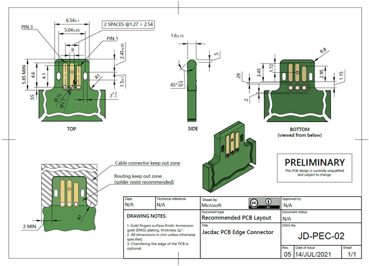
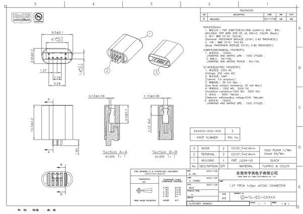
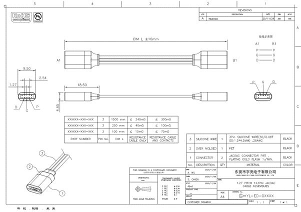

# Jacdac Connector

## PCB Edge Connector

Please refer to the latest [technical drawing of the Jacdac PCB edge connector](https://github.com/microsoft/jacdac-ddk/blob/main/connector/JACDAC_PCB_Edge_Connector_Drawing_JD-PEC-02_rev_05.pdf)
for full details. Note how the Jacdac electrical contacts are shorter on the bottom side of the PCB because they must not connect electrically to the adjacent plated through-holes.

Note that the order of pins is the same on top and bottom, or in other words pin 1 on top is above pin 3 on bottom, and vice versa.
This is because the cable (see below) has contacts only on one side, and has to work when plugged in upside-down.
The connection between pin 2 on the top and pin 2 on the bottom is made with a single via as shown in the drawing, whereas the other connections are made with short traces within the connector footprint. The trace connecting the JD_PWR pins should be as short as possible and at least 0.29mm (0.012") wide.

## PCB edge connector libraries

Ready-made libraries for some popular electronics CAD tools, Altium, Eagle, KiCAD, are available at [https://github.com/microsoft/jacdac-ddk/tree/main/design/examples](https://github.com/microsoft/jacdac-ddk/tree/main/design/examples).

## Cable

The first manufacturer of Jacdac cable connectors and cable assemblies is [Dongguan Yuliang Electronics](http://dgyuliang.net/) who are also known by their [Cylconn](http://www.cylconn.com/) brand.

)
