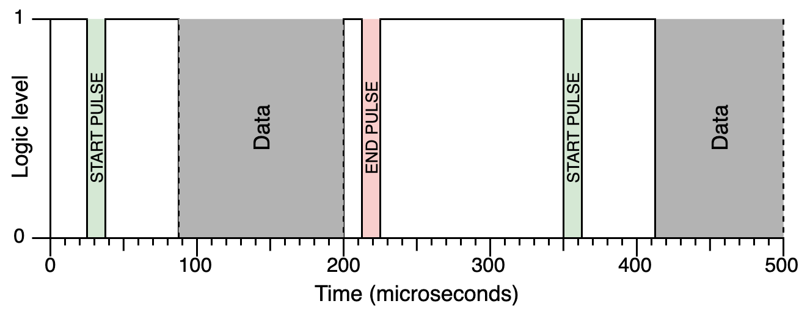
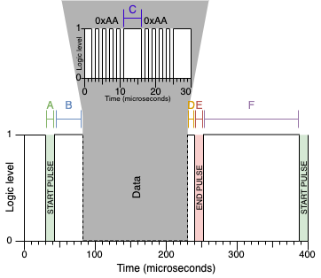
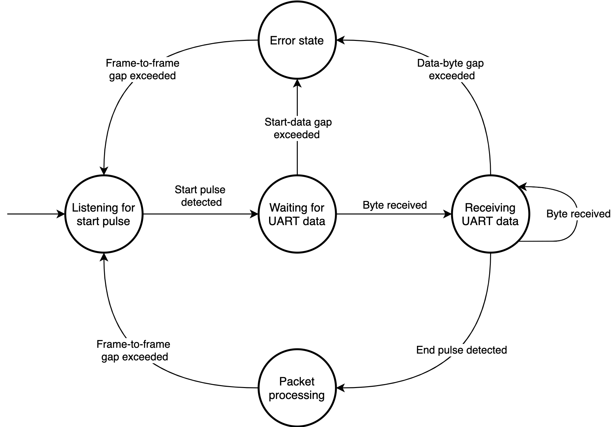

# Protocol Specification

Jacdac is a new protocol designed 
to make it easier to connect low cost microcontrollers and sensors together. 
Jacdac is not only designed for easier physical connectivity, 
it is an entire hardware and software stack that bridges the world of the low cost 
microcontroller to the web browser and beyond.

* novel 3-wire cable and connector
* bus topology
* device discovery and service advertisement
* standardized service abstraction
* full stack from 8bit MCU to web development

## Overview

A Jacdac device is any device that generates its own unique [device identifier](#device-identity) 
and implements the Jacdac protocol.  The protocol consists of three core layers, described below,
with link to more detail.

### Service layer: how devices share hardware or software resources with one another

The way Jacdac devices share resources with other devices on the bus are through __services__. 
Services provide abstract, standardized interfaces that can be used to interact with 
physical hardware resources (e.g. an accelerometer) or pure virtual resources 
(e.g. the state of a video game). This abstraction brings plug-and-play dynamism to 
Jacdac so that devices with different hardware, but the same overall functionality, 
can replace one another without having to recompile user applications. For example, 
two different models of accelerometer hardware can replace each other 
because they share the same software interface. 

Any device that hosts a service must also run the control service. 
The control service is responsible for advertising any services a device 
is running every 500 milliseconds. Like any other service, 
the packets emitted by the control service are standardized. 
There also a set of common commands that must be implemented by Jacdac devices that operate services, 
including functionality like `reset` and `time since boot`.

Most Jacdac users will never need to write a service: the major use case is for users 
to write applications that interact with Jacdac devices and services. 
Using Jacdac in microcontroller applications is incredibly easy and only 
requires a software stack that has a compatible Jacdac physical layer.

Services are registered in the [service catalog](/services/) 
and described by [service specifications](/reference/service-specification/).

* [Read more about the service layer](#service-layer)

### Transport layer: responsible for reliably routing packets to and from services and applications

Whenever a frame is received by the physical layer, the transport layer 
divides that frame into data packets and forwards them to the appropriate service 
or user application. At this point, services and applications can use packets 
to perform actions based on new data.

In many cases it is important that data is received by a specific device. 
Jacdac supports this mechanism using acknowledgements and pipes. 
Acknowledgements are incredibly simple and require receiving devices 
to recognize that a frame has successfully been received. 
Pipes on the other hand set up a point to point connection between devices, 
and every packet is acknowledged and received using a sliding window approach. 
Only the most capable devices are expected to support pipes.

* [Read more about the transport layer.](#transport-layer)

### Physical layer: transmits/receives packets to/from other Jacdac devices

There can be many various physical layer implementations responsible 
for sending frames across a wired or wireless communication medium. 
Frames contain one or more packets, and packets contain a service command or report. 
Frames also have addressing metadata embedded inside them that the transport 
layer uses to route packets correctly.

* [Read more about the physical layer.](#physical-layer)

## Device Identity

**By design, the Jacdac protocol does not support allocation of unique device identifiers.** 
Instead, each device must assign itself a 64-bit device identifier that uniquely identifies it on the bus. 
This identifier is used to determine the sending or receiving device, and for devices to remember one another on the bus. 
Once generated, a device's identifier must remain constant. As long identifiers are generated with appropriate entropy (see analysis below), there is little chance of identifier collision. 
We recommend the following ways of generating a unique identifier:

1. Use the random number generator (found below) to allocate an identifier for each device. 
The number generator could even be included into automated flashing processes to ensure appropriate entropy.

2. Use the generator below to seed a hardware random number generator. 
The hardware random number generator could use sensor values to create further entropy.

Most often, the device identifier will be assigned by the device's bootloader and stored in non-volatile flash. 
For an example, see [the Jacdac bootloader for STM32x0](https://github.com/microsoft/jacdac-stm32x0/blob/master/bl/blmain.c).

<RandomGenerator device={true} />

If we consider one trillion Jacdac networks size of 200 devices with randomly chosen 64 bit JDIDs, 
the probability of a JDID collision in at least one of the networks is 0.1%. 
On the other hand, with 32 bit IDs and 2000 networks, the collision probability in any of them is already 1%, 
and with 200k networks it's more than 60%.

## Service Layer

The way Jacdac devices share resources with other devices on the bus are through __services__. 
Services provide abstract, standardized interfaces that can be used to interact with 
physical hardware resources (e.g. an accelerometer) or pure virtual resources 
(e.g. the state of a video game). This abstraction brings plug-and-play dynamism to 
Jacdac so that devices with different hardware, but the same overall functionality, 
can replace one another without having to recompile user applications. 
For example, two different models of accelerometer hardware can replace each other 
because they share the same software interface.

Services act on __commands__ and optionally respond with __reports__. 
Reports can also be emitted separately from a service without prompting from another device. 
This interface is specified in a [custom markdown language](/reference/service-specification/) 
that lists the possible commands and reports that a service can consume and emit. 
Specifications can also inherit from other specifications. An example of this can be seen in the [sensor specification](../../../services/_sensor). Jacdac sensors inherit commands and reports from this specification, creating a set of base functionality for _all_ sensors.

A service is globally and uniquely identified by its service class, which should be found in the [service catalog](../../../services). For example, the service class of the [button service](../../../services/button) is `0x1473a263`, as specified in the button's [service specification](https://github.com/microsoft/jacdac/blob/main/services/button.md) in the GitHub repository that contains the registered services. (In contrast, the `service_index` field in the Jacdac packet is an index into the list of services advertised by a device. The control service has both service class 0 and service number 0.)

### Commands

Commands are 16-bit and specified in the `service_command` field of a Jacdac packet. A command is composed of a 4-bit operation and a 12-bit code.

The operation is stored in the top most nibble of the `service_command` field. The following table below outlines all possible operations; `XXX` represents any 12-bit command code:

| Operation number | Command 	|
|--------|------------	|
| `0x0XXX` | Action	|
| `0x1XXX` | Register read	|
| `0x2XXX` | Register write	|
| `0x3XXX`- `0x7XXX` | Reserved	|
| `0x8XXX`- `0xfXXX` | Events	|

#### Actions

Actions are a type of command that cause a service to begin to carry out a task. An example action might be to calibrate a magnetometer.

Services can freely allocate their own action command codes in the following range:

| Action code range | Purpose 	|
|--------|------------	|
| `0x080-0xeff` | Service defined action command codes 	|

However, services __must not__ allocate any of the common or reserved action command codes specified in the table below:

| Action code range | Purpose 	|
|--------|------------	|
| `0x000-0x07f` | Common action command codes	|
| `0xf00-0xfff` | Reserved action command codes	|

Common action command codes are allocated in the [system specification](../../../services/_system).

#### Registers

Registers are properties that represent the state of a service.  Registers are variable length and are between 1 byte and 236 bytes (max payload) in size. Sequential register codes do not overlap with one another. For example, it is possible to have register `0x090` of size `12` and non-overlapping register `0x091` of size `4`.

Registers can be accessed and modified by register read (`0x1XXX`) and register write (`0x2XXX`) operations. Registers can be specified to be read-only or read-write capable. Trying to write to a read-only register will result in a nop (no operation). Because registers can have different access attributes they are segmented into different command code ranges.

Register command codes can be freely allocated in the following ranges:

| Register code range | Purpose 	|
|--------|------------	|
| `0x080-0x0ff` | Read-write register codes specific to a service	|
| `0x180-0x1ff` | Read-only register codes specific to a service	|
| `0x280-0x2ff` | Additional register codes specific to a service. Should generally be avoided.	|

However, services __must not__ allocate any of the common or reserved register command codes specified in the table below:

| Register code range | Purpose 	|
|--------|------------	|
| `0x001-0x07f` | Read-write registers common to all services	|
| `0x100-0x17f` | Read-only registers common to all services	|
| `0xf00-0xfff` | Reserved for future use.	|

Common register command codes are allocated in the [system specification](../../../services/_system).

#### Reports

Reports are packets sent by a service as a response to a command. They can also be used to independently broadcast important information such as events.

The layout of a report depends on its purpose:
*  __Register reports__ must always contain the register values requested in the original command packet, but for actions, the format is left up to the service creator to define.
* __Actions reports__ can either contain a pre-determined number of bytes as defined in the service specification or bear no operation.
* __Events__ are emitted independently by a service without prompting. 
Some services may offer an interface to configure which events are emitted. Events are discussed in details in the next section.

#### Events

Events have a specially-constructed operation code:

| Bits | Function 
|------|----------------------
| 15   | Always set for events
| 14:8 | Sequential counter
| 7:0  | Event code

Event codes `0x00-0x7f` are common to all services, and codes `0x80-0xff` are service-specific.
Events can (but often don't) contain payloads.

Event reports are sent in the same way as any other packet, and `device_identifier`, `service_index`, and `service_command` differentiate it from other types of reports. These differentiators provide a unique namespace for each service. Multiple event reports can be sent by using multiple packets in the same frame.

The counter in operation code is incremented by 1 for every event emitted.
This is global to device, not per-service.
Every event is typically emitted 3 times:
* once when it happens
* the first repetition after about 20ms
* the second repetition after about 100ms

Each repetition is emitted with the same sequential counter.

The client should ignore the repetitions it receives.
However, if the client misses an event, it will likely get the repetition, and handle that.
The client should maintain the last sequential number for every device.
If an event `X` comes with a sequential number in advance of what's expected, the client should drop it,
wait for the preceding event(s), and eventually handle the repetition of `X` when it arrives.
The client thus handles events in sequential order.

As a motivation, consider a device with button services.
If these are handled purely through events, the client will maintain the pressed state for each button.
For this, it's critical not to swap order of up/down events.
To recognize button combinations, it's important not to swap order of events from the two services.

### The control service

Each device runs its own control service, which emits advertisement packets roughly every 500 milliseconds. The service class of the control service is zero (0). Each advertisement contains the device's identifier (as usual) as well a list of services offered by the device; other devices on the bus can inspect these advertisements and subsequently communicate with the advertised services to incorporate them in user applications.

The control service also offers a set of common commands that can be used to query/inspect each Jacdac device. For example, the `IDENTIFY` command causes a Jacdac device to perform an action that allows a user to locate a particular device, usually through blinking an LED. In addition to emiting an advertisement packet every 500 milliseconds, a device that hosts one or more services must respond to all commands listed in the [control service specification](../../../services/control).

The implementation complexity of the control service scales with respect to the number of services a device implements. For instance, it is very simple to process packets for a single user service (in addition to the control service), but complexity increases as more services are added. This flexibility is a benefit as it allows ultra low-cost microcontrollers to be used in simple devices.

## Transport Layer

A device's presence/absence on the bus is signified by the presence/absence of advertising packets containing its device identifier, which should be sent every 500 milliseconds. If a client of a Jacdac device does not receive an advertisement from the device for several advertisement periods (1-2 seconds), it should assume the device has left the bus. If the device rejoins the bus, it may present a different list of services. In fact, devices are free to change the list of services they advertise at any time.

### Jacdac frames, packets and service indices

A Jacdac frame contains a list of Jacdac packets (of length at least one), which all share the same device identifier and flags (see the logical description of a Jacdac packet below). The frame also contains a cyclic redundancy code (CRC). If the device identifier of the frame matches the device's identifier, then the device sends an acknowledgement containing the frame's CRC (JD_SERVICE_NUMBER_CRC_ACK).

A Jacdac packet is described by the following structure:

```c
struct {
    uint8_t flags;
    uint64_t device_identifier;
    uint8_t service_size;         // size of the data payload
    uint8_t service_index;        // the index into the device's advertised list of services
    uint16_t service_command;
    uint8_t data[0];
}
```

The above structure omits the details about physical transmission of Jacdac packets over the wire and the packing of multiple packets within frames. For more information, see [the single wire serial protocol](../physical-layer/sws).

A device will generally maintain device-specific state for each of the services that it supports. This state should be kept in an array, where each array entry contains the service class and (a pointer to) the device-specific state for that service. When a device advertises its service classes they are presented in the same order as in the list.  This allows clients of the device to refer to one of its services by list index (`service_index`, an 8 bit quantity) instead of service class (a 32 bit quantity). The zero index (service number) is reserved for the control service. 

In fact, only low six bits of `service_index` are currently used, with the two high bits reserved.
This is because, it is impossible to enumerate more than 59 services (including control service).
The following table lists allowed values for `service_index`.

 `service_index` | Meaning
-----------------|-------------
`0x00`           | Control service
`0x01`-`0x3a`    | Regular services
`0x3b`           | Reserved
`0x3c`           | Reserved
`0x3d`           | Reserved
`0x3e`           | Pipe packet (see below)
`0x3f`           | ACK packet (see below)
`0x40`-`0x7a`    | Error responses for services
`0x7b`-`0xff`    | Reserved

#### flags

A packet contains only one device identifier (rather than both source and destination identifiers, as in IP). If the lowest bit of `flags` is set, the packet is a _command packet_ and `device_identifier` is the destination device receiving the packet; otherwise, the packet is a _report packet_ and `device_identifier` is the source device broadcasting information on the bus. Read more about command and report packets in the next section.

If the second bit of `flags` is set

If the third bit of `flags` is set (_multicast commands_), then the low order 32 bits of the `device_identifier` field are treated as a service class. The command is then directed to all services with that service class.

| Flag bit | Interpretation
|----------|-------------------------------------
| `0x01`   | if set, the `device_identifier` is the recipient of command; if clear, the `device_identifier` is the sender of a report
| `0x02`   | if set, an ACK should be issued with CRC
| `0x04`   | if set, the device_identifier contains target service class number (multicast)
| `0x80`   | if set, the packet comes from Jacdac vNext and should be ignored by the current implementation

### Acks

If a frame is received by the control layer, and is then routed correctly,
an ACK may need to be sent.
This only applies when frame contains command packets,
device identifier equals our device identifier,
and the second bit of frame flags is set.

ACK packet uses our device identifier, service number of `0x3f`,
and uses the CRC of the packet being acknowledged as the service command.
The payload is zero-sized.

All devices, except for the most resource-constrained bootloaders,
should be able to send ACKs.
They should indicate that in their advertisement packet.

### Pipes

Pipes are application-level mechanism for establishing reliable one- and two-way
point-to-point data links.

Typical packet loss in Jacdac networks is well under 1%.
Anything that can withstand such packet loss **should not** be done over a pipe,
as pipes have quite big overhead.

Typical applications where pipes should be used:
* a WiFi service, where the pipe represents a TCP connection
* when a response to a command doesn't fit in one packet (eg. WiFi scan results)
* when events need to be delivered reliably (eg., RFID reader)

Pipes should generally not be used for:
* streaming sensor data (sensor events are OK)
* video data
* audio data

The way to initially establish a pipe depends on service, but typically
device A would send a command to device B to establish a pipe.
Device A would include its device identifier and _port_
(a 9 bit number of A's choosing; there would normally be one port per pipe) in the command.
If a two-way communication is desired, device B could then state the port on its side.

Both devices can then start sending commands to their respective ports.
The pipe commands use a fixed service number of `0x3e` and set the require-ACK
flag on frames.
The service command is split as follows:

| Bits  | Description
|------:| ------------------------------------
|   4:0 | Wrap around packet counter
|   6:5 | Content type
|  15:7 | Port number

The packet counter starts at `0x0` goes up to `0x1f`, and then back to `0x0`.
Rationale: there can be up to 30 non-empty packets in a frame.

Content type is:
* `0` for regular pipe data
* `1` for regular pipe data after which the pipe is to be closed
* `2` for service-specific out-of-band meta-data
* `3` is reserved

The sending protocol is:
* wait for any data that needs to be sent over the pipe
* send it as a command; wait for ACK
* if we timeout waiting for ACK, repeat previous step
* if we repeated 10 times already, close the pipe
* increment the pipe counter
* go back to the first step

The wait for ACK should follow exponential back-off, starting with 1ms up to 1024ms.

The receiving protocol keeps a counter for each pipe. This counter starts at 0.
* when a pipe command is received, ACK it (this is usually done generically, not only for pipes)
* if stored counter for pipe doesn't match the counter in the packet, drop the packet
* increment stored counter
* process data in packet
* repeat

The protocol above has an effective window of 1.
The counter allows increasing that up to 31, but this would require dealing with
multiple packets per frame and is currently out of scope.

Pipes should be considered closed when the device at the other end resets.

TODO: Zero-length pipe commands can be sent as keep-alive packets. Is this needed?

Note that pipes are transmit streams of Jacdac packets, not streams of bytes.
They should not be recombined at any layer in the implementation.
For example, a command that returns a list of things can send each thing in a separate
pipe packet, without any additional info about how to chunk the data
(provided each thing fits in a packet).
Multiple packets can be grouped in a frame, but are still handled separately at the
destination.

### Reliable actions

Actions can be invoked reliably by requesting an ACK.
However, since this may involve excessive re-transmission, it only works correctly
for idempotent actions.

We say an action is _idempotent_, when it doesn't matter if it is invoked once or multiple times
within ~100ms (without interleaving of other commands).
For example, `clear all`, `set` and `remove` actions on a configuration store are idempotent.
Another example is when an action is likely to take much longer than 100ms, and new invocations
while in progress are ignored, for example `calibrate` command on a sensor.
Yet another example is when the difference between single and multiple invocations is not perceptible to 
the user (eg., starting a fade-glow operation on an LED).
Actions that are **not** idempotent are marked with `unique` attribute in the specifications.

Multiple invocations of actions that specify the same pipe in the arguments are implicitly ignored
(since, it's not possible to open the same pipe multiple times simultaneously).
Thus, they do not require the `unique` attribute.

For non-idempotent actions, a pipe can be opened with a `reliable_commands` action on the control service.
Actions (or any other commands) can then be sent over that pipe.
Support for this is indicated as a flag in the advertisement packet.

### Error responses

When a device cannot handle a command, it can send an error response (instead of ignoring the command).
This is to indicate that it correctly received the command packet, but will not handle it.
An error response uses the same `service_command`, `device_identifier`, and `service_index`
as the offending command, except that it sets the second-highest bit of `service_index`
(`service_index` values between `0x40` and `0x7a` are allocated for this purpose).

The payload of the error response can be empty, indicating a general error.
Otherwise, the first byte of the response indicates the error code,
and the rest is service- or device-specific.

| Code          | Description
|--------------:| ------------------------------------
| `0x00`        | General error
| `0x01`        | Command not supported
| `0x02`        | Invalid command arguments
| `0x03`        | Invalid state
| `0x04`-`0x7f` | Reserved
| `0x80`-`0x8f` | Busy, try again in approx. `16 << (code - 0x80)` ms
| `0x90`-`0xff` | Reserved

## Physical Layer

The responsibility of the physical layer is to send/receive a byte buffer 
(representing a Jacdac frame from the transport layer 
over a particular media. Currently, we have implemented:

- Single Wire Serial connects microcontrollers to each other using UART
- Web USB: micro-controller to web browser

### Single Wire Serial (SWS)

Jacdac requires devices have a microcontroller with UART, Timer, and GPIO interrupt capabilities.



For communication Jacdac SWS reuses the often forgotten RS232 (UART) peripheral, 
common to many microcontrollers. Devices operate the UART peripheral in half-duplex mode 
and are connected together to form a single bus. 
This bus requires a common data and ground line to be shared between devices.

Like with standard UART, a logical one is represented as 3.3V and a logical 0 as 0V. 
Data bytes are 10 bits long and are composed of 1 start bit, 8 data bits, and one stop bit. 
Jacdac devices must only communicate at 1 Mbaud and when no data is being transmitted, 
the bus must read as a logical one (3.3V).

In Jacdac SWS, any device can initiate a transmission at any time.
Because of this, devices must assert control over the bus before sending any data. 
This is where Jacdac differs from half-duplex UART–––devices must assert control over the bus 
by pulsing the line low before transmitting any data. This low pulse is known as the start pulse 
and must be between 11 and 15 microseconds in duration. This duration is recognized 
as a break condition on most UART hardware.

When the start pulse is over, devices have minimally 50 microseconds to configure IO registers 
to receive UART data. If no data byte is received within 200 microseconds, 
an error condition must be triggered and devices must wait for the bus to return to an idle state. 
This means that the first data byte must commence at 189 microseconds 
after the completion of the start pulse in order to be specification compliant.
Devices should strive to start transmission as close as possible after the 50 microsecond mark.

After the transmitter has sent the data portion of a frame, it must then pulse 
the line low one final time to signal the end of a transmission. 
The duration of this end pulse is also between 11 and 15 microseconds so to trigger 
another UART break condition. The end pulse can come immediately after the last data byte, 
but it must occur within 80 microseconds of the last data byte. If it does not, 
an error condition is generated.

A small amount of time must pass before another transmission can begin. 
Devices must wait minimally 100 microseconds plus a randomly generated backoff value 
so that multiple devices do not initiate transmission at precisely the same time. 
It is therefore extremely important that all devices have some randomness in their transmission sequence
to reduce the likelihood of data loss.

A complete Jacdac transmission and the beginning of another are captured in the image below.

TODO: the picture uses outdated delays.


#### Hardware requirements

There is no silicon implementation of Jacdac SWS and a microcontroller is currently required to implement the behavior above. The diversity of microcontrollers and the flexibility of UART hardware means that there are many pathways to reaching a specification compliant Jacdac SWS implementation.

To recap, Jacdac SWS requires the following basic functionality:

* Transmitting / receiving UART-style (10 bits: 1 byte, 1 stop bit, 1 start bit) bytes at 1Mbaud in half-duplex mode (implemented in hardware or in software via bit-banging).
* A GPIO with an internal or external 300k pull up and support for interrupts (implemented in hardware or in software by spin waiting).
* The ability to keep time (whether through instruction counting or a hardware timer).
* The ability to generate random numbers (or at least seed a software random number generator).

<!--
We enumerate a few of the options we have explored below.

#### 32-bit ARM processors

Many ARM processors come with DMA-able (Direct Memory Access) UART peripherals. This means that no CPU intervention is required to send or receive UART data. Many of these processors also support half-duplex mode and internally tie RX to TX together when this mode is selected. For microcontrollers that do not support internal ties, these pins can usually be connected to each other externally for the same effect. Internal pull ups and timers often also come built into this class of microcontroller.

Jacdac has been implemented on the following 32-bit ARM processors:

* Atmel SAMD21, SAMD51
* Nordic NRF52832, NRF52833, NRF52840
* STM 32F0, 32F1, 32F4

#### 8-bit processors

8-bit processors are typically not as capable as 32-bit ARM processors, but they are often cheaper. Throughout the design of Jacdac we have considered this class of processor and have implemented Jacdac on 8-bit processors with and without UART support. Through a software UART implementation via the PADAUK PMS150C, Jacdac can be added to any sensor at the cost of 2.5 US cents.-->

#### Transmission sequence

1. Place GPIO in high impedance input mode.
2. Check to see if the line is low.
   - If the line is already low, start the reception sequence instead.
3. Place GPIO pin in output mode
4. Pulse the line low for 11––15 microseconds.
5. Configure the UART peripheral with the correct baud rate and begin transmitting data after (minimally) 40 microseconds.


#### Reception sequence

1. Place GPIO in high impedance input mode with a PullUp.
2. Enable GPIO edge interrupts, UART break interrupts, or spin wait until the line goes low.
3. When the start pulse has finished, configure UART registers appropriately. It is better to wait until the start pulse is complete as in some cases UART hardware may incorrectly detect a data byte or trigger an error condition.
4. Receive data until the end pulse is detected.

#### Error detection

The image and table below captures key timings of Jacdac SWS.



| Identifier 	| Name 	| Duration min/max (us) 	|
|------------	|-------------	|----------	|
| A          	|Start pulse	|11/15	|
| B          	|Start-data gap	|60/89	|
| C          	|Data-byte gap	|0/80	|
| D          	|Data-end gap	|0/80	|
| E          	|End pulse	|11/15	|
| F          	|Frame-to-frame gap	|200/	|

The state machine below encapsulates how these timings should be used during frame reception:




#### Frames

Jacdac devices communicate over the Jacdac bus via frames. A frame
contains a device identifier and one or more packets and has the following structure:

```c
struct _jd_frame_t {
    uint16_t frame_crc;
    uint8_t frame_size;
    uint8_t frame_flags;
    uint64_t device_identifier;
    uint8_t data[240]; // maximum
} __attribute__((__packed__, aligned(4)));
typedef struct _jd_frame_t jd_frame_t;
```

On the wire, the frame must be transmitted in little endian format (i.e. low byte of `frame_crc` first). The total maximum frame size is 252 bytes, selected to keep the total size of packet under `255` (the DMA limit on some hardware) and aligned to 4. The following table defines the meaning and size of the fields in the structure above.

| Memory offset | Field size (bytes) 	| Field name 	| Description  	|
|--------|------------	|-------------	|----------	|
| 0 | 2          	|`frame_crc`	| [16-bit CRC CCITT](https://en.wikipedia.org/wiki/Cyclic_redundancy_check) of all following fields. |
| 2 | 1          	|`frame_size`	| Size of the data field.	|
| 3 | 1          	|`frame_flags`	| Flags specific to this frame.	|
| 4 | 8          	|`device_identifier`	| 64-bit device identifier.	|
| 12 | 1 * `frame_size `  	|`data`	| The data payload of the frame.	|

### Frame flags

The `frame_flags` field is used to indicate

| Bit position | Bit name 	| Description 	|
|--------|------------	|-------------
| 0 | COMMAND	| If set, the frame contains command packets, if not set, the frame contains report packets. 	|
| 1 | ACK_REQUESTED	| If set, the receiver should respond to sender with an ACK frame, if not set, no response is required. 	|
| 2 | DEVICE_ID_ALT_MEANING	|  	|
| 3-7 | RESERVED	| Reserved for future use.	|

### Packets

The data portion of a Jacdac frame is also structured and is internally divided into one or more packets. __Zero length frames are not supported__.

Each packet has the following layout in memory:

```c
struct _jd_packet_t {
    uint8_t service_size;
    uint8_t service_index;
    uint16_t service_command;
    uint8_t payload[236];
} __attribute__((__packed__, aligned(4)));
typedef struct _jd_packet_t jd_packet_t;
```

The following table defines the meaning and size of the fields in the structure above. The meaning of these fields will become clearer later on in this document.

| Memory offset | Field size (bytes) 	| Field name 	| Description  	|
|--------|------------	|-------------	|----------	|
| 12 | 1	|`service_size`	| The size of the payload field. Maximum size is 236 bytes. |
| 13 | 1	|`service_index`	| The instance number of the destination service.	|
| 14 | 2	|`service_command`	| A number that specifies an operation and code combination.	|
| 16 | 1 * `service_size`	|`payload`	| The packet data payload destined for a particular service.	|

Packets are placed back-to-back inside the frame `data` field and must be padded so they start at a 4 byte boundary (i.e. `service_size` is divisible by 4). Logically, packets placed in the same frame share the same frame fields and thus the same `device_identifier`. This means that only one device can be addressed in a single frame.
