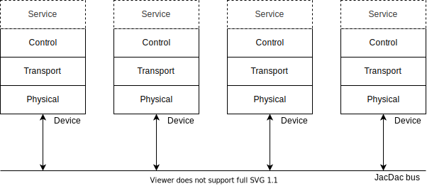
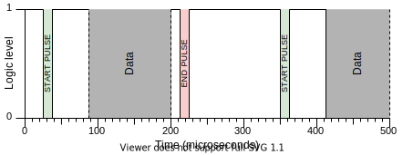
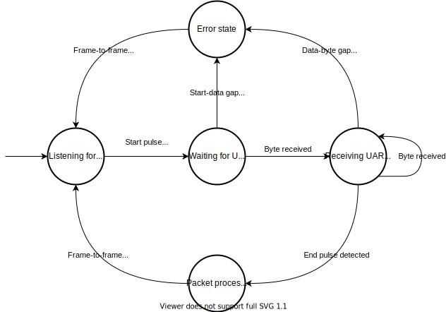

# Single Wire Serial (SWS)

The JacDac single wire serial (SWS) implementation provides a universal interface for interconnecting microcontrollers and peripherals. It makes use of an often forgotten protocol that is nearly as common as I2C and SPI, __UART__.

JacDac devices that use the single wire serial implementation are connected in a bus topology to a shared electrical medium (wire, or PCB trace). Each device operates a software stack consisting of four layers:

1. [Physical](#the-physical-layer): this layer handles the transmission and reception of packets.
2. [Transport](./transport.md): this layer handles packet queuing for user applications and optionally manages reliable communication via pipes.
3. [Control](./control.md): this layer is responsible advertising a device on the bus and receiving control commands from other devices.
4. (optional) [Service](./service.md): this layer contains zero or more services that serve resources to the bus. Services model device resources and can be physical resources like sensors, or virtual resources like memory.

## The Physical Layer

For communication JacDac SWS reuses the often forgotten RS232 (UART) peripheral, common to many microcontrollers. Devices operate UART peripherals in half-duplex mode and are connected together to form a single bus. This bus requires a shared data line and a common ground line between devices.

Like with standard UART, a logical one is represented as 3.3V and a logical 0 as 0V. Data bytes are 10 bits long and are composed of 1 start bit, 8 data bits, and one stop bit. JacDac devices must only communicate at 1 Mbaud. When no data is being transmitted, the bus must read as a logical one.

In the SWS implementation of JacDac, any device can initiate a transmission at any time. Because of this, devices must assert control over the bus before sending any data. This is where JacDac differs from half-duplex UART–––devices must assert control over the bus by pulsing the line low before transmitting any data. This low pulse is known as the start pulse and must be between 11 and 15 microseconds in duration. This duration is recognised as a break condition on most UART hardware.

When the start pulse is over, devices have minimally 40 microseconds to configure IO registers to receive UART data. If no data byte is received within 80 microseconds, an error condition must be triggered and devices must wait for the bus to return to an idle state. This means that the first data byte must commence at 69 microseconds after the lo pulse in order to be specification compliant.

After the transmitter has sent its data, it must then pulse the line low one final time to signal to other devices it has finished its transmission. The duration of this end pulse is between 11 and 15 microseconds so to trigger another UART break condition. The end pulse can come immediately after the last data byte, but it must occur within 80 microseconds of the last data byte. If it does not, an error condition is generated and devices must wait until the bus has entered an idle state.

A complete JacDac transmission and the beginning of another are captured in the image below.

### Hardware requirements

There is no silicon implementation of JacDac SWS and a microcontroller is currently required to implement the behaviour above. The diversity of microcontrollers and the flexibility of UART hardware means that there are many pathways to reaching a specification compliant JacDac SWS implementation.

To recap, SWS requires the following basic functionality:

* Transmitting / receiving UART-style (10 bits: 1 byte, 1 stop bit, 1 start bit) bytes at 1Mbaud in half-duplex mode (implemented in hardware or in software via bit-banging).
* A GPIO with an internal or external 300k pull up and support for interrupts (implemented in hardware or in software by spin waiting).
* The ability to keep time (whether through instruction counting or a hardware timer).
* The ability to generate random numbers (or at least seed a software random number generator).

We enumerate a few of the options we have explored below.

#### 32-bit ARM processors

Many ARM processors come with DMA-able (Direct Memory Access) UART peripherals. This means that no CPU intervention is required to send or receive UART data. Many of these processors also support half-duplex mode and internally tie RX to TX together when it is selected. For microcontrollers that do not support internal ties, these pins can usually be connected to each other externally for the same effect. Internal pull ups and timers are often come built in with this class of microcontroller.

JacDac has been implemented on the following 32-bit ARM processors:

* Atmel SAMD21, SAMD51
* Nordic NRF52832, NRF52833, NRF52840
* STM 32F0, 32F1, 32F4

#### 8-bit processors

8-bit processors are typically not as capable as 32-bit ARM processors, but they are often cheaper. Throughout the design of JacDac we have considered this class of processor and have implemented JacDac on 8-bit processors with and without UART support. Through a software UART implementation via the PADAUK PMS150C, JacDac can be added to any sensor at the cost of 2.5 US cents.

## Transmission sequence

1. Place GPIO in high impedence input mode.
2. Check to see if the line is low.
   - If the line is already low, start the reception sequence instead.
3. Place GPIO pin in output mode
4. Pulse the line low for 11––15 microseconds.
5. Configure the UART peripheral with the correct baud rate and begin transmitting data after (minimally) 40 microseconds.

## Reception sequence

1. Place GPIO in high impedence input mode with a PullUp.
2. Enable GPIO edge interrupts, UART break interrupts, or spin wait until the line goes low.
3. When the start pulse has been detected configure UART registers appropriately. We recommend UART hardware is enabled after the start pulse is complete––otherwise the UART hardware may incorrectly detect a data byte or trigger an error condition.
4. Receive data until the end pulse is detected. This can be achieved easily on most hardware via interrupts or by polling the line state from software.

## Error detection

The image below captures key timings of JacDac SWS. An error condition must be triggered whenever any of the protocol timings are violated.

| Identifier 	| Name 	| Duration min/max (us) 	|
|------------	|-------------	|----------	|
| A          	|Start pulse	|11/15	|
| B          	|Start-data gap	|40/69	|
| C          	|Data-byte gap	|0/80	|
| D          	|Data-end gap	|0/80	|
| E          	|End pulse	|11/15	|
| F          	|Frame-to-frame gap	|100	|

The image below encapsulates how these timings should be used during packet reception:

