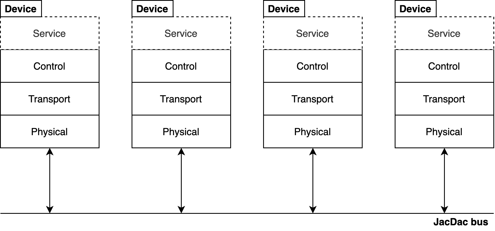

# Single Wire Serial (SWS)

### Version 1.0

The JACDAC single wire serial (SWS) implementation provides a universal interface for interconnecting microcontrollers and peripherals. It makes use of an often forgotten protocol that is nearly as common as I2C and SPI, __UART__.

JACDAC devices that use the single wire serial implementation are connected in a bus topology to a shared electrical medium (wire, or PCB trace). Each device operates a software stack consisting of four layers:

1. [Physical](#the-physical-layer): this layer handles the transmission and reception of packets.
<!--2. [Transport](./transport.md): this layer handles packet queuing for user applications and optionally manages reliable communication via pipes.-->
2. [Control](#the-control-layer): this layer is responsible advertising a device on the bus, receiving control commands from other devices, and routing packets to applications.
2. (optional) [Service](./service.md): this layer contains zero or more services that serve resources to the bus. Services model device resources and can be physical resources like sensors, or virtual resources like memory.



## The Physical Layer

For communication JACDAC SWS reuses the often forgotten RS232 (UART) peripheral, common to many microcontrollers. Devices operate the UART peripheral in half-duplex mode and are connected together to form a single bus. This bus requires a common data and ground line to be shared between devices.

Like with standard UART, a logical one is represented as 3.3V and a logical 0 as 0V. Data bytes are 10 bits long and are composed of 1 start bit, 8 data bits, and one stop bit. JACDAC devices must only communicate at 1 Mbaud and when no data is being transmitted, the bus must read as a logical one (3.3V).

In JACDAC SWS, any device can initiate a transmission at any time. Because of this, devices must assert control over the bus before sending any data. This is where JACDAC differs from half-duplex UART–––devices must assert control over the bus by pulsing the line low before transmitting any data. This low pulse is known as the start pulse and must be between 11 and 15 microseconds in duration. This duration is recognised as a break condition on most UART hardware.

When the start pulse is over, devices have minimally 40 microseconds to configure IO registers to receive UART data. If no data byte is received within 100 microseconds, an error condition must be triggered and devices must wait for the bus to return to an idle state. This means that the first data byte must commence at 89 microseconds after the completion of the start pulse in order to be specification compliant.

After the transmitter has sent the data portion of a frame, it must then pulse the line low one final time to signal the end of a transmission. The duration of this end pulse is between 11 and 15 microseconds so to trigger another UART break condition. The end pulse can come immediately after the last data byte, but it must occur within 80 microseconds of the last data byte. If it does not, an error condition is generated.

A small amount of time must pass before another transmission can begin. Devices must wait minimally 100 microseconds plus a randomly generated backoff value so that multiple devices do not initiate transmission at precisely the same time. It is therefore extremely important that all devices have some randomness in their transmission sequence to reduce the likelihood of data loss.

A complete JACDAC transmission and the beginning of another are captured in the image below.


### Hardware requirements

There is no silicon implementation of JACDAC SWS and a microcontroller is currently required to implement the behaviour above. The diversity of microcontrollers and the flexibility of UART hardware means that there are many pathways to reaching a specification compliant JACDAC SWS implementation.

To recap, JACDAC SWS requires the following basic functionality:

* Transmitting / receiving UART-style (10 bits: 1 byte, 1 stop bit, 1 start bit) bytes at 1Mbaud in half-duplex mode (implemented in hardware or in software via bit-banging).
* A GPIO with an internal or external 300k pull up and support for interrupts (implemented in hardware or in software by spin waiting).
* The ability to keep time (whether through instruction counting or a hardware timer).
* The ability to generate random numbers (or at least seed a software random number generator).

<!--
We enumerate a few of the options we have explored below.

#### 32-bit ARM processors

Many ARM processors come with DMA-able (Direct Memory Access) UART peripherals. This means that no CPU intervention is required to send or receive UART data. Many of these processors also support half-duplex mode and internally tie RX to TX together when this mode is selected. For microcontrollers that do not support internal ties, these pins can usually be connected to each other externally for the same effect. Internal pull ups and timers often also come built into this class of microcontroller.

JACDAC has been implemented on the following 32-bit ARM processors:

* Atmel SAMD21, SAMD51
* Nordic NRF52832, NRF52833, NRF52840
* STM 32F0, 32F1, 32F4

#### 8-bit processors

8-bit processors are typically not as capable as 32-bit ARM processors, but they are often cheaper. Throughout the design of JACDAC we have considered this class of processor and have implemented JACDAC on 8-bit processors with and without UART support. Through a software UART implementation via the PADAUK PMS150C, JACDAC can be added to any sensor at the cost of 2.5 US cents.-->

## Transmission sequence

1. Place GPIO in high impedence input mode.
2. Check to see if the line is low.
   - If the line is already low, start the reception sequence instead.
3. Place GPIO pin in output mode
4. Pulse the line low for 11––15 microseconds.
5. Configure the UART peripheral with the correct baud rate and begin transmitting data after (minimally) 40 microseconds.


## Reception sequence

1. Place GPIO in high impedence input mode with a PullUp.
2. Enable GPIO edge interrupts, UART break interrupts, or spin wait until the line goes low.
3. When the start pulse has finished, configure UART registers appropriately. It is better to wait until the start pulse is complete as in some cases UART hardware may incorrectly detect a data byte or trigger an error condition.
4. Receive data until the end pulse is detected.

## Error detection

The image and table below captures key timings of JACDAC SWS.


| Identifier 	| Name 	| Duration min/max (us) 	|
|------------	|-------------	|----------	|
| A          	|Start pulse	|11/15	|
| B          	|Start-data gap	|40/89	|
| C          	|Data-byte gap	|0/80	|
| D          	|Data-end gap	|0/80	|
| E          	|End pulse	|11/15	|
| F          	|Frame-to-frame gap	|100/	|

The state machine below encapsulates how these timings should be used during frame reception:


## Frame layout


The previous sections have discussed line signalling of a frame but there has been little discussion around how the data portion of a frame is organised.

The data portion of a JACDAC frame has the following layout in memory:

```c
struct _jd_frame_t {
    uint16_t frame_crc;
    uint8_t frame_size;
    uint8_t frame_flags;
    uint64_t device_identifier;
    uint8_t data[240]; // maximum
} __attribute__((__packed__, aligned(4)));
typedef struct _jd_frame_t jd_frame_t;
```

On the wire, the frame must be transmitted in little endian format (i.e. low byte of `frame_crc` first). The total maximum frame size is 252 bytes, selected to keep the total size of packet under `255` (the DMA limit on some hardware)and aligned to 4. The following table defines the meaning and size of the fields in the structure above.

| Memory offset | Field size (bytes) 	| Field name 	| Description  	|
|--------|------------	|-------------	|----------	|
| 0 | 2          	|frame_crc	| [16-bit CRC CCITT](https://en.wikipedia.org/wiki/Cyclic_redundancy_check) of all following fields. |
| 2 | 1          	|frame_size	| Size of the data field.	|
| 3 | 1          	|frame_flags	| Flags specific to this frame.	|
| 4 | 8          	|device_identifier	| 64-bit device identifier.	|
| 12 | 1 * frame_size   	|data	| The data payload of the frame.	|

The data portion of a JACDAC frame is also structured and is internally divided into 1 or more packets. __Zero length frames are not supported__.

Each packet has the following layout in memory:

```c
struct _jd_packet_t {
    uint8_t packet_size;
    uint8_t service_instance;
    uint16_t service_command;
    uint8_t payload[236];
} __attribute__((__packed__, aligned(4)));
typedef struct _jd_packet_t jd_packet_t;
```

The following table defines the meaning and size of the fields in the structure above. The meaning of these fields will become clearer later on in this document.

| Memory offset | Field size (bytes) 	| Field name 	| Description  	|
|--------|------------	|-------------	|----------	|
| 12 | 1	|packet_size	| The size of the payload field. Maximum size is 236 bytes. |
| 13 | 1	|service_instance	| The instance number of the destination service.	|
| 14 | 2	|service_command	| A number that specifies an operation and code combination.	|
| 16 | 1 * packet_size	|payload	| The packet data payload destined for a particular service.	|

Packets are placed back-to-back inside the frame `data` field and must be padded so they start at a 4 byte boundary (i.e. `packet_size` is divisible by 4). Logically, packets placed in the same frame all share the same frame fields and thus the same `device_identifier`. This means only one device can be addressed in a single frame.


## Services

The way JACDAC devices share resources with other devices on the bus are through __services__. Services can represent physical hardware resources (e.g. an accelerometer) or pure virtual resources (e.g. distributed shared memory). Services act on __commands__ and optionally respond with or emit __reports__.

Services themselves are specified in a custom markdown language. The specification lists the possible commands and reports a service can consume and emit. Specifications can also inherit from other specifications. A great example of this can be seen in the [sensor specification](../services/_sensor.md). JACDAC sensors inherit commands and reports from this specification, creating a set of base functionality for _all_ sensors.

### Commands

Commands are 16-bit and specified in the `service_command` field of a JACDAC packet. A command is composed of a 4-bit operation and a 12-bit code.

The operation is stored in the top most nibble of the `service_command` field. The following table below outlines all possible operations; XXX represents any 12-bit command code:

| Operation number | Command 	|
|--------|------------	|
| `0x0XXX` | Action	|
| `0x1XXX` | Register read	|
| `0x2XXX` | Register write	|
| `0x3XXX`- `0xfXXX` | Reserved	|

#### Actions

Actions are a type of command that cause a service to begin to carry out a task. An example action might be to set the angle of a servo to 90 degrees.

Services can freely allocate their own action command codes in the following range:

| Action code range | Purpose 	|
|--------|------------	|
| `0x080-0xeff` | Service defined action command codes 	|

However, services __must not__ allocate any of the common or reserved action command codes specified in the table below:

| Action code range | Purpose 	|
|--------|------------	|
| `0x000-0x07f` | Common action command codes	|
| `0xf00-0xfff` | Reserved action command codes	|

Common action command codes are allocated to base specifications (e.g. the [sensor specification](../services/_sensor.md)). Any service that inherits from a base specification is expected to respond to command codes it specifies.

#### Registers

Registers are properties that represent the state of a service.  Registers are variable length and are between 1 byte and 236 bytes (max payload) in size. Sequential register codes do not overlap with one another. For example, it is possible to have register `0x090` of size `12` and non-overlapping register `0x091` of size `4`.

Registers can be accessed and modified by register read (`0x1XXX`) and register write (`0x2XXX`) operations. Registers can be specified to be read-only or read-write capable . Trying to write to a read-only register will result in a nop (no operation). Because registers can have different access attributes they are segmented into different command code ranges.

Register command codes can be freely allocated in the following ranges:

| Register code range | Purpose 	|
|--------|------------	|
| `0x080-0x0ff` | Read-write register codes specific to a service	|
| `0x180-0x1ff` | Read-only register codes specific to a service	|
| `0x280-0x2ff` | Additional register codes specific to a service. May be used in exceptional circumstances.	|

However, services __must not__ allocate any of the common or reserved register command codes specified in the table below:

| Register code range | Purpose 	|
|--------|------------	|
| `0x001-0x07f` | Read-write registers common to all services	|
| `0x100-0x17f` | Read-only registers common to all services	|
| `0xf00-0xfff` | Reserved for future use.	|

Common register command codes are allocated to base specifications (e.g. the [sensor specification](../services/_sensor.md)). Any service that inherits from a base specification is expected to implement and respond to the registers it specifies.

### Reports

## The control service

JACDAC devices that are providing services to the bus must implement the Control service.

The control service is responsible for advertising a device and maintaining a list of active devices on the bus. This list does not have to be an exhaustive list and can consist of only those devices of particular interest or no devices at all.

JACDAC SWS provides an easy way for devices to spot devices of interest on the bus. Roughly every 500 milliseconds, devices announce their presence in an advertisement report. The report contains a list of services for  to use on the bus. If a device has no services to offer it is not required to send an advertisement packet.


## Packet routing

Packets are routed to __services__, which are discussed later on in this document. Each packet contains all the information required for a packet to reach its intended service.


## Unique device identifiers